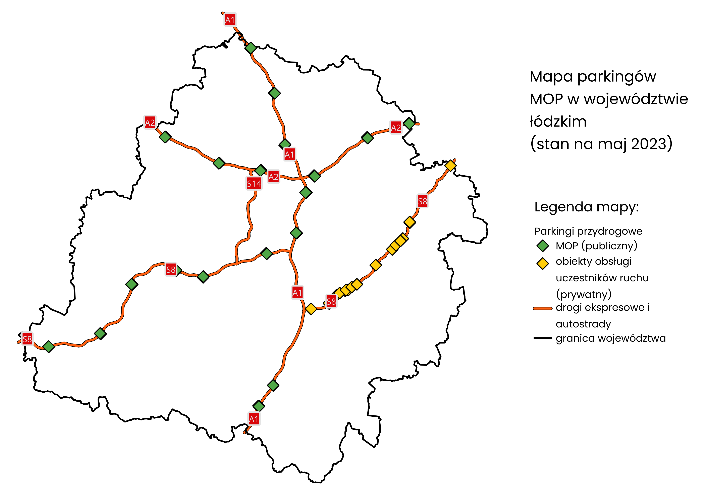
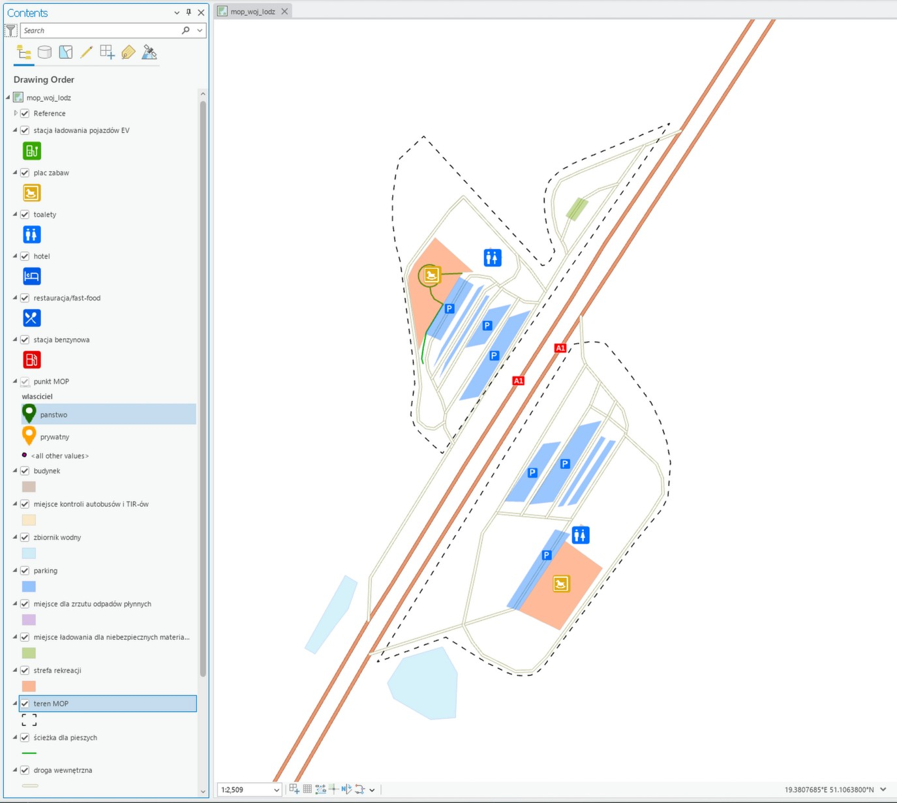

# Mapa parkingów MOP w województwie łódzkim (2023)

[Projekt został laureatem konkursu Łódzkie na mapach 2023
](https://mapy.lodzkie.pl/lodzkie-na-mapach-2023/) 

Mapa punktów w województwie:

Dokładniejszy plan parkingu MOP (przykład ze Stobiecka, autostrada A1)

Mapa przedstawia rozmieszczenie parkingów MOP (Miejsce Obsługi Podróżnych) na terenie województwa łódzkiego z odróżnieniem na dwa kategorie, czyli państwowy, czyli parking zarządzany przez GDDKiA (leżący w tzw. pasie drogowym) i prywatny, czyli parking należący do prywatnego właściciela, różniący się powierzchniowo od zwykłego MOPa.

Projekt został wykonany w programie ArcMap 10.8.
Dane zostały uzyskane z takich źródeł jak OpenStreetMap (sieć dróg ekspresowych i autostrad), Google Maps (informacje o działających na parkingach lokalach komercyjnych, badanie terenu MOP za pomocą Street View), GDDKiA (wykaz istniejących parkingów MOP, stan na maj 2023), geoportal.gov.pl (Ortofotomapa).

Aby uruchomić projekt należy pobrać to repozytorium, rozpakować archiwum i uruchomić plik: projekt.mxd (ArcMap) lub projekt.mpk (ArcMap/QGIS).
